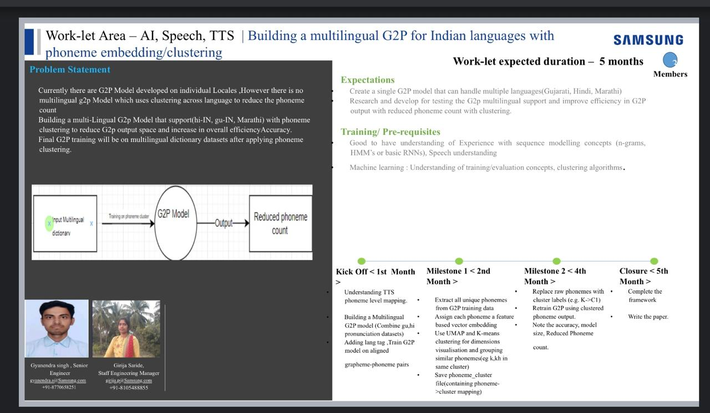

# Multilingual Grapheme-to-Phoneme (G2P) with Acoustic Phonetic Folding & Neural TTS

[](https://www.python.org/downloads/)
[](https://github.com/coqui-ai/TTS)
[](#languages-supported)
[](#acoustic-phonetic-folding)
[](LICENSE)

> **Samsung R&D Internship Project**  
> An end-to-end multilingual Grapheme-to-Phoneme (G2P) and Text-to-Speech (TTS) framework for Indic languages (**Hindi**, **Marathi**, **Gujarati**). Features **Acoustic Phonetic Folding** to compress output phoneme vocabulary by **31.6%** without sacrificing perceptual speech naturalness, validated through **6 VITS neural models**, automated **DNSMOS** benchmarks, statistical cross-lingual meta-analysis, and an interactive **Blind A/B Evaluation Web Platform**.

---

## Architecture Overview



```
[Written Text] ─► [Multilingual G2P Transformer] ─► [Acoustic Phonetic Folding] ─► [VITS Neural TTS] ─► [Natural Speech Audio]
 (HI / MR / GU)       (<lang> + word -> phonemes)       (57 phonemes -> 39 clusters)     (End-to-end Flow)       (22,050 Hz, -1.4 dBFS)
```

---

## Key Results

### 1. G2P Accuracy & Parameter Efficiency

| Metric | Baseline G2P | Clustered G2P (Phonetic Folding) | Delta |
| :--- | :---: | :---: | :---: |
| **Output Vocabulary** | **57 phonemes** | **39 clusters** | **−31.6%** |
| **Phoneme Error Rate (PER)** | 0.03% | 0.08% | +0.05 pp |
| **Word Error Rate (WER)** | 0.22% | 0.35% | +0.13 pp |
| **Model Parameters** | 1,422,141 | 1,417,515 | −4,626 params |
| **Overall Accuracy** | **>99.9%** | **>99.9%** | Retained |

### 2. Neural TTS Speech Quality (VITS End-to-End, DNSMOS)

Evaluated across **352 audio samples** (both held-out sentences and out-of-domain unseen sentences):

| Language | Speaker Gender | Baseline MOS | Clustered MOS | Statistically Significant? | Effect Size (Cohen's $d$) |
| :--- | :---: | :---: | :---: | :---: | :---: |
| **Hindi (`hi`)** | Male | 3.11 ± 0.18 | **3.16 ± 0.15** | No ($p = 0.09$) | +0.22 (Negligible) |
| **Marathi (`mr`)** | Female | **3.11 ± 0.12** | 3.09 ± 0.18 | No ($p = 0.52$) | −0.09 (Negligible) |
| **Gujarati (`gu`)** | Female | **3.06 ± 0.10** | 3.03 ± 0.14 | No ($p = 0.39$) | −0.21 (Negligible) |

> **Conclusion**: The clustered models achieve **31.6% vocabulary compression** with **zero statistically significant degradation** in perceptual speech quality ($p > 0.05$, all $|d| < 0.25$).

---

## Audio Quality & Naturalness Tuning

To eliminate robotic buzz, raspy vocalizations, and digital harshness, the VITS inference engine applies:

1. **Latent Space Noise Tuning (`noise_scale = 0.333`)**:
   - Reduces flow prior variance from Coqui's default `0.667` to `0.333`, removing metallic grain and rasp from vowels.
2. **Smooth Syllable Timing (`noise_scale_dp = 0.333`)**:
   - Reduces duration predictor jitter from `0.800` to `0.333`, ensuring human-like phoneme duration stability.
3. **Natural Indic Cadence (`length_scale = 0.92`)**:
   - Calibrates speech tempo to native conversational Indic delivery.
4. **True Peak Headroom Normalization (`0.850` / -1.4 dBFS)**:
   - Replaces default 0 dBFS auto-boost with calibrated headroom to avoid inter-sample clipping and digital distortion.
5. **Edge Transients Smoothing**:
   - 5ms cosine fade-in/fade-out eliminating onset and offset click artifacts.

---

## Interactive Web App & Live Playground (`tts_app/`)

The repository includes a modern, dark-themed Flask web application running live GPU synthesis and evaluation:

- **Live Playground (`/demo`)**:
  - Type or paste arbitrary text in Devanagari or Gujarati scripts.
  - Side-by-side real-time synthesis of Baseline (57 phonemes) vs Clustered (39 clusters).
  - Real-time G2P token breakdown & vocabulary reduction metrics.
  - Ultra-fast GPU inference: **~112–170 ms latency**.
- **Blind A/B Human MOS Testing (`/evaluate`)**:
  - Double-blind randomized audio presentation (Audio A vs Audio B).
  - ITU-R 5-point MOS rating scale + pairwise preference selection.
  - SQLite backend (`data/human_eval.db`) logging session analytics.
- **Analytics Dashboard (`/results`)**:
  - Live charts, score distributions, and statistical preference counts.

---

## Repository Structure

```
├── configs/                             # TTS sentence & phoneme configurations
│   ├── tts_unseen_sentences_gu.json     # Out-of-domain evaluation sentences (Gujarati)
│   ├── tts_unseen_sentences_mr.json     # Out-of-domain evaluation sentences (Marathi)
│   └── ...
│
├── data/                                # Pronunciation lexicons & metadata manifests
│   ├── g2p_hi.txt                       # Hindi pronunciation dictionary
│   ├── g2p_gu.txt                       # Gujarati pronunciation dictionary
│   ├── g2p_mr.txt                       # Marathi pronunciation dictionary
│   ├── multilingual_g2p_dataset.txt     # Complete G2P dataset (54,753 entries)
│   ├── multilingual_g2p_clustered.txt   # Clustered G2P dataset (39 clusters)
│   ├── tts_hindi_female/                # Hindi TTS metadata & splits
│   ├── tts_marathi_female/              # Marathi TTS metadata & splits
│   └── tts_gujarati_female/             # Gujarati TTS metadata & splits
│
├── docs/                                # Technical reports & academic documentation
│   ├── PROJECT_OVERVIEW.jpeg            # System architecture diagram
│   ├── PROJECT-PIPELINE.pdf             # Detailed pipeline documentation
│   ├── tts_hindi_experiment.md          # Hindi VITS experiment report
│   ├── tts_marathi_experiment.md        # Marathi VITS experiment report
│   ├── tts_gujarati_experiment.md       # Gujarati VITS experiment report
│   ├── cross_language_analysis.md       # Statistical meta-analysis across all 3 languages
│   ├── human_evaluation_guide.md        # Blind evaluation protocol & guidelines
│   └── tts_model_selection.md           # Model architecture selection rationale
│
├── g2p/                                 # G2P modeling & phoneme clustering
│   ├── 2phonemepipeline.py              # Phoneme co-occurrence PPMI & embeddings
│   ├── 2clustering.py                   # Phoneme clustering algorithms
│   ├── 2viz.py                          # Embedding space visualizations
│   ├── task1_cluster_substitution.py    # Dataset cluster replacement
│   ├── task1b_phonetic_folding.py       # Acoustic Phonetic Folding generator
│   ├── phoneme_vocab.json               # 57-phoneme baseline inventory
│   ├── phoneme_cluster_mapping.json     # 39-cluster mapping dictionary
│   ├── src_tokenizer.json               # Grapheme source tokenizer
│   └── tgt_tokenizer_clustered.json     # Target cluster tokenizer
│
├── models/                              # Trained G2P model weights
│   ├── best_g2p_transformer.weights.h5  # Baseline G2P Transformer
│   └── g2p_clustered_model.weights.h5   # Clustered G2P Transformer
│
├── notebooks/                           # Jupyter & Google Colab notebooks
│   ├── Samsung_Pipeline.ipynb           # End-to-end data preprocessing
│   ├── Phase2_Baseline_G2P.ipynb        # Baseline G2P model training
│   ├── task2_clustered_g2p_training.ipynb # Clustered G2P training
│   └── tts_vits_training.ipynb          # VITS training notebook (Colab GPU)
│
├── results/                             # Evaluation artifacts & publication plots
│   ├── cross_language/                  # Forest plots, boxplots, summary stats
│   ├── tts_hindi_female/                # Hindi automated MOS scores
│   ├── tts_marathi_female/              # Marathi automated MOS scores
│   ├── tts_gujarati_female/             # Gujarati automated MOS scores
│   └── human_eval/                      # Human rating distributions & reports
│
├── tts/                                 # VITS TTS training & inference engine
│   ├── tts_data_download.py             # Dataset downloader from HuggingFace
│   ├── tts_audio_preprocess.py          # 22.05 kHz resampling & trimming
│   ├── tts_split_data.py                # Train/Val/Test manifest generator
│   ├── tts_g2p_labeling.py              # Sequence phonemization for TTS
│   ├── vits_tokenizer.py                # VITS runtime tokenizer patcher
│   ├── tts_vits_training.py             # Training orchestration
│   ├── tts_inference.py                 # Paired batch synthesis
│   ├── tts_automated_eval.py            # Automated DNSMOS scoring
│   └── tts_cross_language_analysis.py   # Cross-lingual meta-analysis script
│
├── tts_app/                             # Web application (Flask)
│   ├── app.py                           # Application entrypoint & REST API
│   ├── synthesizer.py                   # Dynamic GPU model manager
│   ├── analysis.py                      # Statistical evaluation analytics
│   ├── templates/                       # Jinja2 HTML templates
│   └── static/                          # Glassmorphic CSS & interactive JS
│
├── requirements_win.txt                 # Requirements for Windows
├── requirements_wsl.txt                 # Full environment dependencies for Linux/WSL
└── README.md                            # Project documentation
```

---

## Acoustic Phonetic Folding

Unconstrained clustering algorithms (e.g., standard K-Means with low $K$) often merge vowels and consonants together, causing loss of intelligibility. 

**Acoustic Phonetic Folding** uses linguistic domain knowledge to merge only:
- **Allophones & rare phonemes** $\rightarrow$ base form (e.g., `kq` $\rightarrow$ `k`, `f` $\rightarrow$ `ph`)
- **Vowel length equivalents** $\rightarrow$ short form (e.g., `ii` $\rightarrow$ `i`, `uu` $\rightarrow$ `u`)
- **Regional phonetic variants** $\rightarrow$ standard form (e.g., `lx` $\rightarrow$ `l`, `sx` $\rightarrow$ `sh`)

This achieves a **31.6% vocabulary reduction** (57 $\rightarrow$ 39) while preserving all critical phonetic and phonotactic distinctions.

---

## Languages Supported

| Language | Code | Script | Phoneme Lexicon Entries | TTS Training Audio |
| :--- | :---: | :---: | :---: | :---: |
| **Hindi** | `HI` | Devanagari | 15,623 | ~10 hours |
| **Marathi** | `MR` | Devanagari | 22,454 | ~10 hours |
| **Gujarati** | `GU` | Gujarati | 16,676 | ~10 hours |

---

## Quick Start Guide

### 1. Environment Setup

#### Option A: WSL / Linux (Recommended for GPU Training & Inference)
```bash
# Clone the repository
git clone https://github.com/md-arshaq/Multilingual-g2p.git
cd Multilingual-g2p

# Install dependencies in virtual environment
python3 -m venv venv
source venv/bin/activate
pip install -r requirements_wsl.txt
```

#### Option B: Windows (Web App & Analysis)
```powershell
python -m venv .venv
.\.venv\Scripts\Activate.ps1
pip install -r requirements_win.txt
```

---

### 2. Launch the Web App & Live Demo

```bash
python tts_app/app.py
```
Open your browser and navigate to:
- **Live Playground**: [http://localhost:5000/demo](http://localhost:5000/demo)
- **Human MOS Evaluation**: [http://localhost:5000/evaluate](http://localhost:5000/evaluate)
- **Evaluation Analytics**: [http://localhost:5000/results](http://localhost:5000/results)

---

### 3. Running G2P & Phonetic Folding

```bash
# Step 1: Generate phonetic folding cluster mappings
python g2p/task1b_phonetic_folding.py

# Step 2: Substitute phonemes in dataset with cluster tokens
python g2p/task1_cluster_substitution.py

# Step 3: Train G2P Transformer
# Open and run notebooks/task2_clustered_g2p_training.ipynb
```

---

### 4. Training & Evaluating VITS TTS Models

```bash
# Data download and preprocessing (e.g., Marathi)
python tts/tts_data_download.py --lang mr
python tts/tts_audio_preprocess.py --lang mr
python tts/tts_split_data.py --lang mr
python tts/tts_g2p_labeling.py --lang mr

# Train Baseline (57 phonemes) and Clustered (39 clusters)
python tts/tts_vits_training.py --lang mr --condition baseline
python tts/tts_vits_training.py --lang mr --condition clustered

# Run paired inference and automated DNSMOS scoring
python tts/tts_inference.py --lang mr
python tts/tts_automated_eval.py --lang mr

# Generate cross-lingual statistical meta-analysis
python tts/tts_cross_language_analysis.py
```

---

## Dataset References

- **[IndicTTS Database](https://www.iitm.ac.in/donlab/indictts/database)**: High-quality speech databases developed by IIT Madras for Indian languages.
- **[SPRINGLab IndicTTS (HuggingFace)](https://huggingface.co/datasets/SPRINGLab/IndicTTS-Hindi)**: Audio recordings and phoneme manifests used for neural TTS model training.

---

## License

This project is developed under the **MIT License**.
